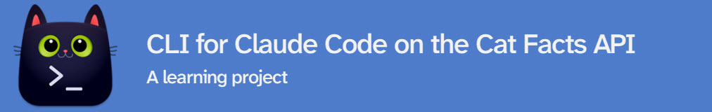

# Cat Facts CLI



A CLI tool that wraps the [Cat Facts API](https://github.com/alexwohlbruck/cat-facts/), designed to be invoked by [Claude Code](https://claude.ai/code) as a shell command. Built as a learning project to explore creating CLI tools that Claude Code can use — a lightweight alternative to building an MCP server. Perhaps more effective - we'll see.

## Why?

Many apps have APIs — Gmail ([REST API](https://developers.google.com/gmail/api)), Microsoft Outlook ([Microsoft Graph](https://learn.microsoft.com/en-us/graph/overview)), [Gamma](https://developers.gamma.app/docs/getting-started), etc. Some have official MCPs, some don't. Either way, writing a small CLI to wrap the API directly may be simpler and more effective.

Why not create an MCP instead of a CLI?

An MCP is itself a wrapper on an API — an extra layer of indirection. Tool definitions and intermediate results flow through the context window, flooding it if you have not used a subagent.

A CLI skips all of that. Claude Code just runs a command and reads stdout — no protocol layer, no tool schemas, no discovery handshake. And Claude Code is already very good with CLIs and Bash.

**Hypothesis:** I think Claude Code will be more effective with a CLI for the tools I want to use.

## Setup

Requires [uv](https://docs.astral.sh/uv/getting-started/installation/) and Python 3.14+.

```bash
git clone https://github.com/michellepace/cat-facts-cli.git
cd cat-facts-cli
uv sync
uv run pre-commit install
```

## References

[Code execution with MCP: Building more efficient agents | Anthropic](https://www.anthropic.com/engineering/code-execution-with-mcp)

Other CLI ideas from [Free APIs](https://free-apis.github.io/):

- Documents & Productivity: I love PDF
- Business: Logo dev
- Universities
- Transportation: (looking for flights)
- Food & Drink: Whiskey Hunter
